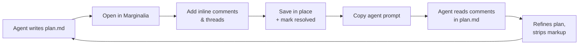

# Marginalia

**Review Markdown plans & skills. Leave comments that persist back into the file — in a format any coding agent can read and act on.**

Marginalia turns a coding-agent plan or skill `​.md` into a reviewable document. You read it like a rendered page, highlight a line or select a few words, and write Markdown comments that thread into replies. When you save, the comments are embedded **inline in the same `.md` file** as invisible-but-machine-parseable `<!-- marginalia: … -->` blocks — right next to the line they refer to. Then you click one button and copy a ready-to-paste prompt that tells your coding agent exactly where the comments are and what to do with them.

> *marginalia (n.): notes written in the margins of a document.* That's the whole idea.


---

## Why

Coding agents ship plans and skills as Markdown. Reviewing them today means one of two bad options:

1. **Chat review** — you describe the change in prose, the agent guesses where it applies, context drifts.
2. **Inline edits** — you rewrite the file yourself, which defeats the point of having an agent.

Marginalia gives you a third option: **comment on the exact line or word, in Markdown, then hand the agent a structured map of every thread to address.** The agent reads the comments in place, refines the plan, and strips the markup. The review loop closes without you rewriting anything.

It is **100% local** — no server, no account, no telemetry. Your file never leaves your machine (or your browser). Works offline. Installable as a PWA **and** as a Chrome extension.

---

## Features

- 📝 **Inline, anchored comments** — comment on a whole line/block, or select exact words (the selection gets wrapped with an inline anchor).
- 🧵 **Threaded replies** — reply on any comment; threads nest by depth.
- ✨ **Markdown comments with live HTML preview** — write `` `HELLO` `` or `WORLD`, see it rendered.
- ✏️ **Edit & delete** any comment; **resolve / reopen** threads.
- 💾 **Save back to the same file** in place (Chrome/Edge, File System Access API) — or **Download** anywhere (Firefox/Safari). **Auto-save** toggle.
- 🤖 **Copy agent prompt** — one click, context-aware:
  - *Saved in place* → references the file path + line range, no full content (the agent reads the file).
  - *Not yet saved* → includes the full commented document.
  - Only **unresolved** threads are listed as "to address"; resolved ones are noted for cleanup.
- 🎨 **6 themes** — Auto, Light, Dark, Nord, Solarized Dark, Dracula.
- 🔤 **8 content fonts** — System Sans, Serif, Mono, Rounded, Inter, Lora, JetBrains Mono, Atkinson Hyperlegible.
- 🖱️ **Cursor-following "+"** to add a comment; selection bubble to comment on exact text.
- 📂 **Open / drag-drop / paste**; browser state persists across reloads (IndexedDB); one-click **Reset**.
- 📱 **Responsive** — desktop side-by-side composer, mobile Write/Preview tabs.
- 📦 **Works offline** — the Markdown renderer is bundled, not CDN-loaded.

---

## Quick start

### Web app (PWA)

```sh
cd marginalia
python3 -m http.server 8000
# open http://localhost:8000/  →  click "Install" to add as an app
```

Then: **Open** a `.md` file (e.g. `sample-plan.md`) → set the plan path (click the file tag) → review → **Save** → **🤖 Copy agent prompt** → paste into your agent.

> You can also open `index.html` directly via `file://`, but service-worker registration and in-place save require a secure context (http/localhost), so serve it when you want those.

### Chrome extension (side panel)

```sh
python3 build.py                 # assembles extension/ and a zip
```

Then in Chrome: `chrome://extensions` → enable **Developer mode** → **Load unpacked** → select the `extension/` folder. Click the toolbar icon to open Marginalia in the **side panel** (perfect for reviewing beside your agent's workspace), or press **Alt+Shift+M** to open it in a full tab.

---

## The review loop



---

## How comments are stored (agent-readable)

Comments are embedded as **HTML comments** — invisible to normal Markdown renderers, plain text to any tool that reads files. Threads sit **immediately after the line they refer to**, so reading top-to-bottom preserves context.

### Line / block comment

```md
Some plan line that a reviewer wants to comment on.
<!-- marginalia:thread id="t1" line="3" snippet="Some plan line..." ts="2026-06-28T12:00:00.000Z" -->
<!-- marginalia:c id="c1" replyTo="" ts="2026-06-28T12:00:00.000Z" -->
This step should be split into two — see the routing note below.
<!-- /marginalia:c -->
<!-- marginalia:c id="c2" replyTo="c1" ts="2026-06-28T12:05:00.000Z" -->
Agreed, will split.
<!-- /marginalia:c -->
<!-- /marginalia:thread -->
```

### Selection / word comment

The selected text is wrapped with an inline anchor; the thread references the anchor id.

```md
The theme is stored as a <!-- marginalia:anchor id="a1" -->single string field<!-- /marginalia:anchor -->.
<!-- marginalia:thread id="t2" anchor="a1" line="17" snippet="single string field" ts="..." -->
<!-- marginalia:c id="c3" replyTo="" ts="..." -->
Make this a typed enum value, e.g. `THEME_LIGHT | THEME_DARK | THEME_SYSTEM`.
<!-- /marginalia:c -->
<!-- /marginalia:thread -->
```

### Fields

| Field      | Where       | Meaning                                                          |
| ---------- | ----------- | ---------------------------------------------------------------- |
| `id`       | thread / c  | Stable identifier (`t1`, `c2`, `a3`).                            |
| `line`     | thread      | 1-indexed file line(s) the thread refers to (`5` or `5-7`).      |
| `anchor`   | thread      | Anchor id wrapping the selected text (for selection comments).   |
| `snippet`  | thread      | The referenced text, included for agent context.                 |
| `ts`       | thread / c  | ISO-8601 timestamp.                                              |
| `replyTo`  | c           | Parent comment id; empty for the thread root.                    |
| `resolved` | thread      | `"true"` when the thread is marked done (omitted otherwise).     |

Line numbers are 1-indexed and refer to the **saved file**; `snippet` gives the agent the exact text even if line numbers drift after edits.

### Notes for coding agents

- Any line beginning with `<!-- marginalia:` is review metadata, **not** original content.
- Threads sit directly after the line/selection they refer to — read top-to-bottom.
- Later replies in a thread may supersede earlier ones (agreements / corrections).
- Comments are Markdown — parse them as such.
- The **Copy agent prompt** button emits a full description of this format plus a structured list of every open thread, so you can paste it straight into your agent without explaining anything yourself.

---

## Use cases

- **Review an agent's plan before it codes.** Catch the bad assumption on line 12 before it becomes 200 lines of code.
- **Review a skill / `SKILL.md`** before trusting an agent to follow it.
- **Iterate on a plan over rounds.** Mark threads **resolved** as the agent addresses them; the next prompt only lists what's still open.
- **Multi-reviewer handoff.** Comments are just text in the file — commit them, and the next reviewer (human or agent) sees the full thread history.
- **Side-panel review while coding.** Dock Marginalia beside your editor/agent and comment as you read.

---

## The agent prompt (what gets copied)

The **🤖 Copy agent prompt** button is context-aware:

- **Saved in place** — the prompt *references the file path* and tells the agent the review blocks are inline roughly between lines X–Y; it should open the file, address each open thread, strip the markup, and return the revised plan. **No full content** is included.
- **Not yet saved** — the comments aren't in the source file yet, so the prompt **includes the full document with comments** in a fenced block.
- Only **unresolved** threads are listed as "to address"; resolved ones are noted for cleanup.

**📋 Save & copy** does both in one click (save first, then copy the saved-mode prompt).

Set the **plan path** by clicking the file tag in the header — browsers don't expose the real disk path, so set it once (it defaults to the filename) and it's baked into every saved-mode prompt.

---

## Project layout

```
marginalia/
├── README.md
├── LICENSE
├── index.html              # web app shell (links src/ + vendor/)
├── manifest.json           # web PWA manifest
├── service-worker.js       # offline cache (shell + vendor + fonts)
├── build.py                # assembles the Chrome extension + zip
├── icon.svg                # canonical icon (source for PNGs)
├── icons/                  # PNG icons (16/32/48/128/192/512)
├── sample-plan.md          # a demo file to try the reviewer on
├── src/
│   ├── app.js              # app logic (shared by web + extension)
│   └── styles.css          # styles (shared by web + extension)
├── vendor/
│   ├── marked.min.js       # Markdown renderer (bundled, offline)
│   └── purify.min.js       # DOMPurify (XSS-safe HTML)
└── extension/              # Chrome MV3 extension
    ├── manifest.json       # MV3 manifest (committed)
    ├── background.js       # side-panel + command handler (committed)
    ├── index.html          # full-tab page (generated)
    ├── sidepanel.html      # side-panel page (generated)
    ├── app.js, styles.css, vendor/, icons/   # generated copies
    └── marginalia-extension.zip              # generated, ready for Web Store
```

The web app is the canonical home of `src/app.js` and `src/styles.css`. The extension reuses them via `build.py` (no logic duplication). After editing shared code, re-run `python3 build.py` to refresh the extension.

---

## Releasing the Chrome extension

1. **Build:** `python3 build.py` → produces `extension/marginalia-extension.zip`.
2. **Test locally:** `chrome://extensions` → Developer mode → Load unpacked → select `extension/`. Verify the side panel opens and commenting works.
3. **Publish:** register as a Chrome Web Store developer ($5 one-time fee) → **Add new item** → upload the zip → fill in the listing (category: Productivity; permissions: `sidePanel` only; no remote code) → submit. Review typically takes 1–3 days.

Suggested store listing:

> **Marginalia — review Markdown plans for coding agents**
>
> Open any Markdown plan or skill, leave inline Markdown comments on exact lines or words, and save them back into the file in a format your coding agent can read. One click copies a ready-to-paste prompt that maps every open comment thread for the agent to address. 100% local and offline. Dock it in the Chrome side panel to review beside your work.

---

## Browser support

- **Chrome / Edge** — full support: in-place save (File System Access API), PWA install, offline, and the Chrome extension (side panel).
- **Firefox / Safari** — rendering, commenting, threads, themes, fonts, and **Download** all work. In-place **Save** falls back to a download (no File System Access API). Service-worker offline works over HTTPS/localhost.
- **Offline** — the Markdown renderer is bundled, so the web app renders fully offline after first load. The four web-font options (Inter, Lora, JetBrains Mono, Atkinson Hyperlegible) need a first online load to cache; system fonts always work offline.

---

## Tech notes

- **No build step for the web app** — serve the folder and go. The only build is `build.py` for the extension.
- **No framework** — plain HTML/CSS/JS. `marked` + `DOMPurify` are the only runtime dependencies, bundled in `vendor/`.
- **State** — IndexedDB (document + path) + localStorage (theme, font, auto-save). No network calls except Google Fonts (optional).
- **Safety** — comment/document HTML is sanitized with DOMPurify; file writes go only where you explicitly save.
- **Markup stability** — the `marginalia:` format is versioned-friendly and round-trips through parse → serialize → parse identically (verified).

---

## Roadmap

- Comment **edit history** & "resolved" timestamps
- **Diff view** after the agent revises the plan
- **Multi-file** review (a folder of plans)
- Firefox/Safari extension (once side-panel equivalents land)
- Optional serverless sync for multi-device review

Contributions welcome. Fork → branch → PR.

---

## License

MIT — see [LICENSE](LICENSE).